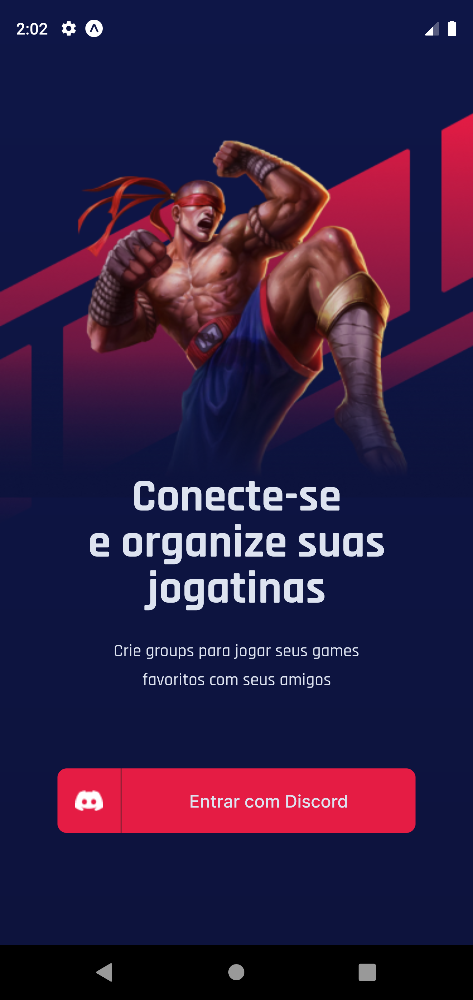
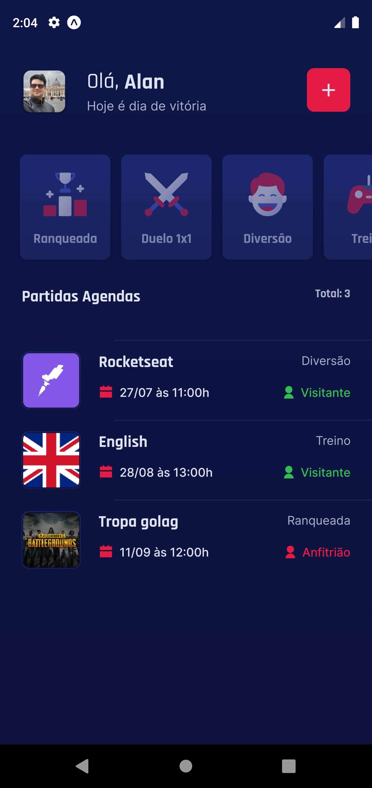
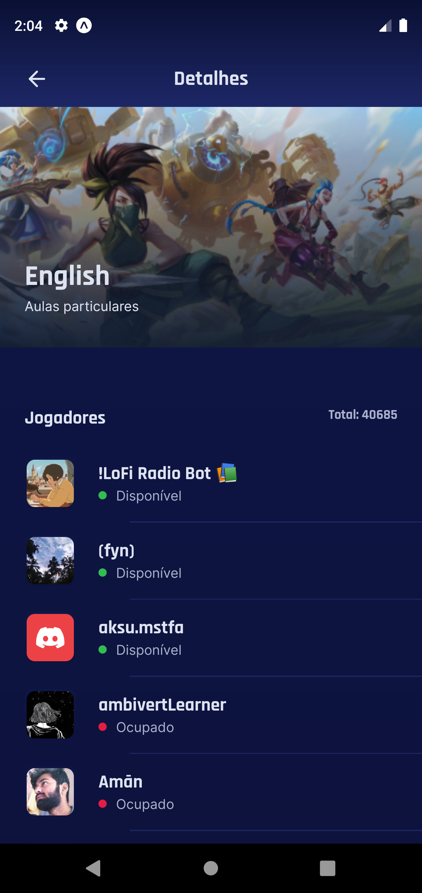
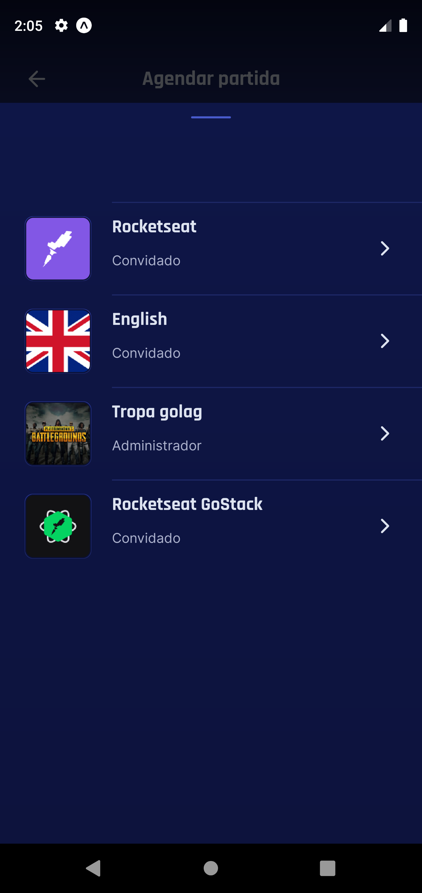
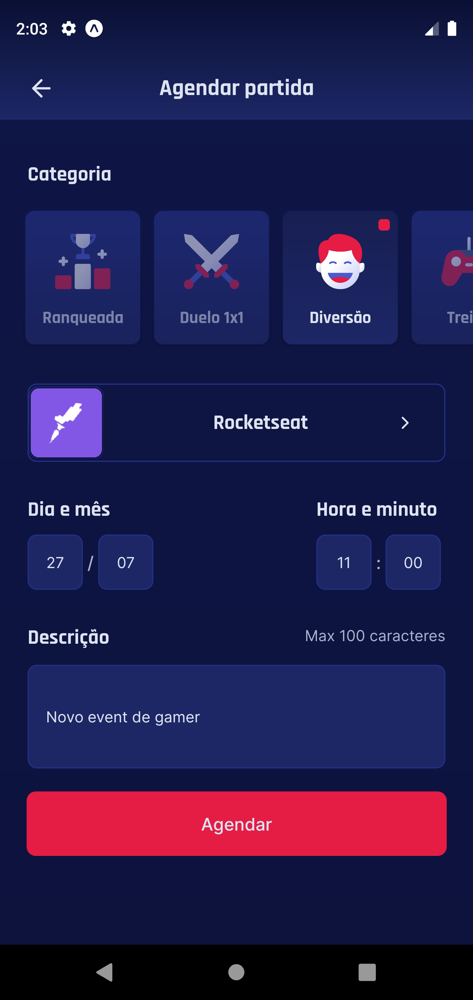

<h1 align="center">
  
</h1>

 <a href="#-Sobre">Sobre</a>&nbsp;&nbsp;&nbsp;|&nbsp;&nbsp;&nbsp; 
 <a href="#-Conteúdo">Conteúdo</a>&nbsp;&nbsp;&nbsp;|&nbsp;&nbsp;&nbsp;
 <a href="#-Tecnologias">Tecnologias</a>&nbsp;&nbsp;&nbsp;|&nbsp;&nbsp;&nbsp;
 <a href="#-Images">Images</a>

<h3 align="center">
  :rocket: [NLW] GamePlay
</h3>

## 💻 Sobre

Projeto desenvolvido durante o NLW da Rocketseat, React native, integração com o discord.

## 🚀 Conteúdo
### Algumas __funcionalidades__
* Realizar login com o discord.
* CRUD(create, read, update, delete) de organização de partidas.
* Filtros para as partidas.
* Lista de jogadores.
* Compartilhar convites de partidas.

## 🚀 Tecnologias
### Algumas tecnologias utilizadas:
- **[React Native](https://reactnative.dev)**
- **[Discord](https://discord.com)**

## 🚀 Images
### Screenshots

  
  
   
  
  

